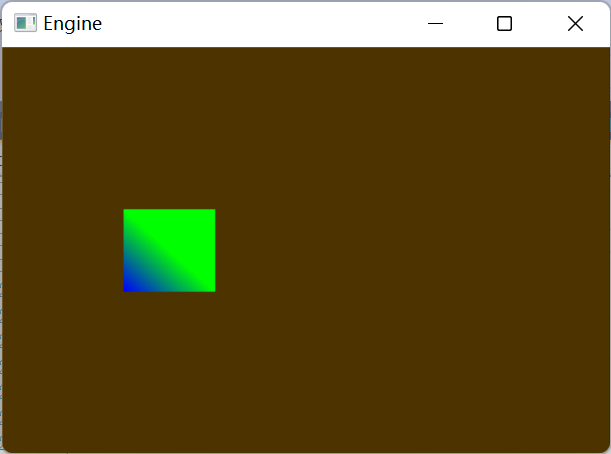

# AREngine
AREngine 将会是一个可以使用各种shader语言的渲染引擎

AnotherRenderEngine(AREngine) is going to create to engin to render all kind of shader, hlsl or complied shader

# Depencies
DirectX官方的win SDK包

(DirectX SDK)

vs 2019 && c++桌面开发工具

(VS + CPP DesktopTop)

# 界面截图

# Feature:
IMGUI（没有的）

Input（实现了一个Input组件，AWSD可移动模型，1,2,3可切换shader)

The Whole Render Pipline（有一点）

# 使用说明
- AWSD移动模型（至少看上去是这样的）
- 1,2,3切换shader(尝试修改./MyShader.fx 和 ./Shader/s2.fx 再按)

# 项目结构说明
/Core               -   一些C++基础类（c++新手，请高手清喷）

/Include            -   新手引用lib,没成功，现没用

/Maths              -   数学库，写了一个不知所谓的Matrix，之后会移动倒 Core 目录

/Render             -   注意！！整个项目仅有的有用代码，要研究渲染管线，只需要看这个目录的代码

/Shader             -   这个项目主要做渲染引擎，杂七杂八的shader

/TexturesAndMat     -   暂时只有贴图，材质球没实现

/TObjects           -   放模型，同上，没实现

WindowsProject1.cpp -   旧的入口文件，废弃，请使用Render/AREngine源.cpp

WindowsProject1.h   -   旧的入口文件，废弃，请使用Render/AREngine源.h

